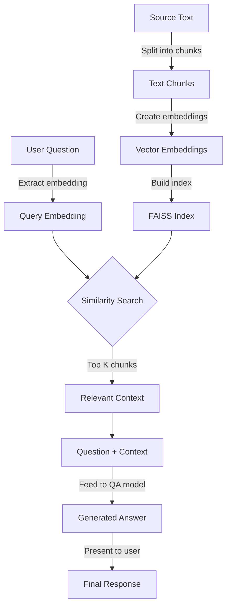
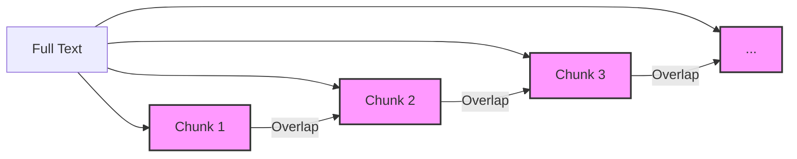
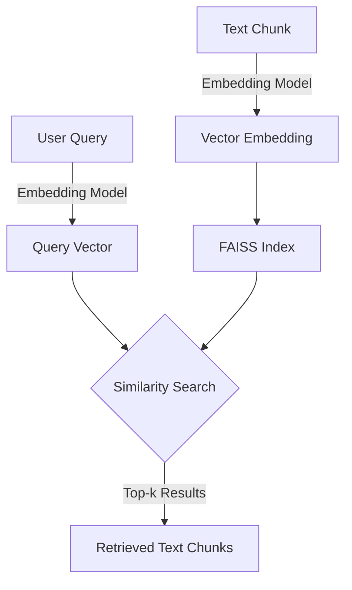

# 🏛️ Roman Empire RAG (Retrieval-Augmented Generation)

[](https://www.python.org/)
[](https://huggingface.co/docs/transformers/index)
[](https://github.com/facebookresearch/faiss)
[](https://arxiv.org/abs/2005.11401)

A demonstration of Retrieval-Augmented Generation (RAG) using historical information about the Roman Empire.

## 📖 Table of Contents

- [🏛️ Roman Empire RAG (Retrieval-Augmented Generation)](#️-roman-empire-rag-retrieval-augmented-generation)
  - [📖 Table of Contents](#-table-of-contents)
  - [📚 Overview](#-overview)
  - [🤔 What is RAG?](#-what-is-rag)
  - [🏗️ Architecture](#️-architecture)
    - [Main Components:](#main-components)
  - [📦 Libraries Used](#-libraries-used)
  - [🚀 Usage](#-usage)
  - [📊 Example Outputs](#-example-outputs)
    - [Example 1:](#example-1)
    - [Example 2:](#example-2)
  - [🔮 Future Improvements](#-future-improvements)
  - [📋 Technical Details](#-technical-details)
    - [Chunk Size Configuration](#chunk-size-configuration)
    - [Embedding and Retrieval Process](#embedding-and-retrieval-process)

## 📚 Overview

This project demonstrates a simple but effective implementation of Retrieval-Augmented Generation (RAG) using Python, Hugging Face Transformers, and FAISS. The system answers questions about the Roman Empire by retrieving relevant context from a knowledge base and generating accurate responses.

## 🤔 What is RAG?

Retrieval-Augmented Generation (RAG) is a hybrid architecture that combines information retrieval with text generation. RAG enhances the capabilities of language models by:

1. **Retrieving** relevant information from a knowledge base in response to a query
2. **Augmenting** the query with this retrieved context
3. **Generating** accurate responses based on both the query and retrieved information

Benefits of RAG include:

- Reduced hallucinations (making up information)
- Up-to-date information (when the knowledge base is updated)
- Ability to cite sources for generated information
- Better handling of specialized or domain-specific knowledge

## 🏗️ Architecture

The RAG pipeline in this project follows these steps:



### Main Components:

1. **Text Splitting**: Divides the source document into manageable chunks with overlap
2. **Embedding Creation**: Converts text chunks into numerical vectors
3. **Index Building**: Creates an efficient similarity search index
4. **Retrieval**: Finds the most relevant text chunks for a query
5. **Answer Generation**: Uses a question-answering model to generate a final response

## 📦 Libraries Used

This project leverages several powerful open-source libraries:

- [**Hugging Face Transformers**](https://huggingface.co/docs/transformers/index): Provides pre-trained language models for embeddings and question answering
  - [sentence-transformers/all-MiniLM-L6-v2](https://huggingface.co/sentence-transformers/all-MiniLM-L6-v2): For creating text embeddings
  - [distilbert-base-cased-distilled-squad](https://huggingface.co/distilbert-base-cased-distilled-squad): For question answering

- [**FAISS (Facebook AI Similarity Search)**](https://github.com/facebookresearch/faiss): High-performance library for efficient similarity search and clustering of dense vectors

- [**NumPy**](https://numpy.org/): For numerical operations on embedding vectors

- [**textwrap**](https://docs.python.org/3/library/textwrap.html): For formatting output text

## 🚀 Usage

Run the main script to see the RAG pipeline in action:

```bash
python roman_empire_rag.py
```

To use the RAG system with your own questions or custom text:

```python
from roman_empire_rag import rag_pipeline, print_wrapped_text

# Define your own source text about any topic
custom_text = """Your custom text here..."""

# Ask a question
question = "Your question here?"
answer, context = rag_pipeline(question, custom_text)

# Display the results
print("\nQuestion:")
print_wrapped_text(question)
print("\nAnswer:")
print_wrapped_text(answer)
print("\nContext Used:")
print_wrapped_text(context)
```

## 📊 Example Outputs

### Example 1:

```
Question:
When was the Roman Empire founded?

Answer:
27 BCE

Context Used:
Founded in 27 BCE when Octavian, the adopted son of Julius Caesar, was granted the title 
of Augustus by the Roman Senate, the Roman Empire succeeded the Roman Republic that had 
existed for nearly 500 years. Augustus established a system of government known as the 
Principate, which maintained the facade of the republic while concentrating power in the 
hands of the emperor.
```

### Example 2:

```
Question:
What was the capital city of the Roman Empire?

Answer:
Rome

Context Used:
The city of Rome was the capital of the empire and served as its political, economic, 
and cultural center. Rome was known for its impressive architectural achievements, 
including the Colosseum, the Pantheon, and the extensive system of aqueducts, roads, and 
public baths. The city's population might have exceeded one million inhabitants during 
its peak.
```

## 🔮 Future Improvements

- Add support for processing multiple documents
- Implement more sophisticated text chunking strategies
- Integrate with a web UI for easier interaction
- Add capability to ingest and process PDF documents
- Experiment with different embedding models for better retrieval
- Incorporate citation mechanisms to track source information
- Add evaluation metrics to measure RAG performance

## 📋 Technical Details

### Chunk Size Configuration

The RAG system uses a chunking strategy with:
- Chunk size: 300 characters
- Overlap: 50 characters

This configuration balances context preservation with retrieval precision.



### Embedding and Retrieval Process



*Note: This project is for educational purposes and demonstrates RAG concepts using the Roman Empire as a knowledge domain. The information provided about the Roman Empire is simplified and may be not comprehensive.*