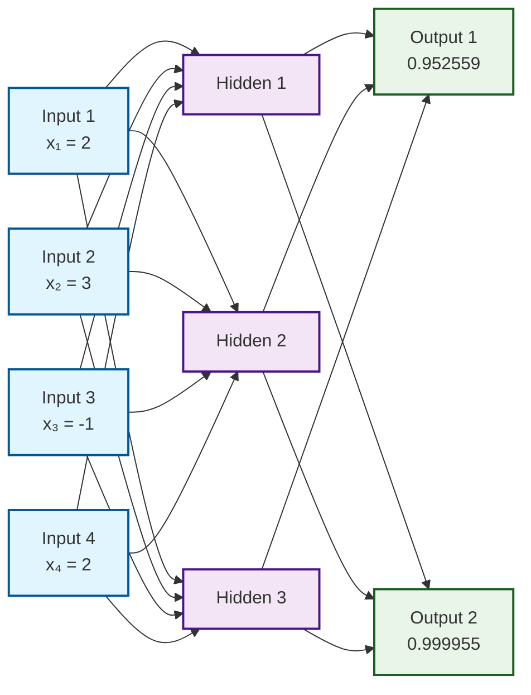

# Neural Network Analysis: 4-3-2 Feedforward Network

## Overview

This project contains a complete analysis of a feedforward neural network with a 4-3-2 architecture (4 input neurons, 3 hidden neurons, 2 output neurons). The network uses sigmoid activation functions and is fully connected between layers.

## Network Architecture



## Network Specifications

- **Architecture**: 4-3-2 (Input-Hidden-Output)
- **Activation Function**: Sigmoid σ(x) = 1/(1 + e^(-x))
- **Total Parameters**: 20 (18 weights + 2 biases)
- **Network Type**: Feedforward, fully connected

## Input Data

The network processes the following input vector:
```
x = [2, 3, -1, 2]
```

## Results Summary

| Layer | Neuron | Pre-activation | Post-activation |
|-------|--------|----------------|-----------------|
| Hidden | 1 | 15.000 | 1.000000 |
| Hidden | 2 | 15.000 | 1.000000 |
| Hidden | 3 | 8.000 | 0.999665 |
| Output | 1 | 2.999665 | 0.952559 |
| Output | 2 | 9.998656 | 0.999955 |

**Final Network Output**: [0.952559, 0.999955]

## Implementation

The forward propagation calculations were performed using a Python script:

```bash
python network.py
```

This script implements the complete forward pass through the network, including:
- Matrix multiplication for weight applications
- Bias addition
- Sigmoid activation function application
- Step-by-step calculation verification

## Weight Matrices

**Input to Hidden Layer (W¹)**:
```
[[2, 3, 0, 1],
 [4, 3, 2, 0],
 [1, 1, 1, 2]]
```

**Hidden to Output Layer (W²)**:
```
[[1, 7, 1],
 [7, 1, 4]]
```

**Bias Vector**: [-6, -2]

## Files

- `network.py` - Python implementation of the neural network forward pass
- `report_neural_network.pdf` - Detailed mathematical analysis and derivations

### Files Structure

```
basic_neural_network_explanation/
├── README.md
├── network.py
├── neural_network_log.txt
└── report_neural_network.pdf
```

## Detailed Analysis

For comprehensive mathematical derivations, step-by-step calculations, and theoretical background, please refer to the complete report in `report_neural_network.pdf`.